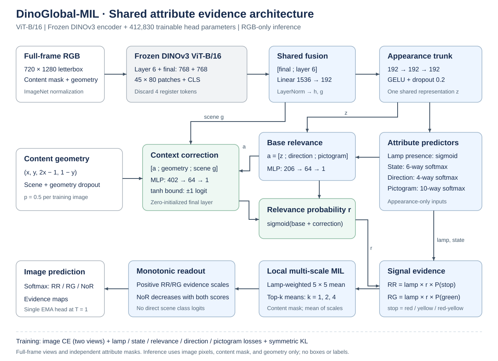

# DinoGlobal-MIL

**Attribute-supervised multiple-instance learning for traffic-light relevance classification with frozen DINOv3 features.**

DinoGlobal-MIL predicts the relevant traffic-light signal for a complete driving
image. Its compact head estimates lamp presence, state, housing direction,
pictogram, and relevance, then aggregates local evidence into an image-level
decision. Training uses lamp annotations; inference requires only an RGB image.

The supported method uses the original shared evidence head and supervision with a
**frozen DINOv3 ViT-B/16 encoder**. [configs/default.yaml](configs/default.yaml)
defines the canonical training protocol; [configs/vitsplus.yaml](configs/vitsplus.yaml)
retains the ViT-S+/16 reference. Both use the same head, losses, augmentation,
preprocessing, and RGB-image-to-three-logits interface.

The retained predictor is one fold-0, epoch-7 **EMA** head. Failed experimental
heads and pilot controllers are excluded from the active package. Their source,
measurements, and selection decisions remain in the
[research archive](docs/experiments/README.md).

## Task and label policy

The model returns three logits in the fixed order **RR, RG, NoR**.

| Class | Image-level annotation rule |
|:--|:--|
| **RR** | At least one relevant red, yellow, or red-yellow lamp. |
| **RG** | At least one relevant green lamp and no relevant RR lamp. |
| **NoR** | No relevant lamp in an RR or RG state, including relevant off/unknown-only scenes. |

RR takes precedence when relevant lamps have conflicting states. Relevance is
defined by dataset annotations. This is image-level classification: evidence
maps are auxiliary outputs, and reported mAP does not use detection IoU thresholds.

## Method



### Full-frame preprocessing and frozen representation

An RGB image is resized isotropically and centered on a **720 × 1280** letterbox
canvas using bicubic interpolation. The complete field of view is retained.
Padding uses RGB (124, 116, 104); a content mask excludes patches entirely within
padding from supervision and evidence pooling. Patch geometry is expressed in
the resized content coordinates, so letterbox margins do not shift its meaning.

The default encoder is **DINOv3 ViT-B/16**, loaded from
[facebook/dinov3-vitb16-pretrain-lvd1689m](https://huggingface.co/facebook/dinov3-vitb16-pretrain-lvd1689m)
at the revision pinned in [backbone.py](src/dinov3_global/backbone.py).
All encoder parameters are frozen and the encoder remains in evaluation mode.
Pixels are normalized with ImageNet mean and standard deviation.

The patch grid has **45 × 80 = 3,600 tokens**. The encoder additionally returns
one CLS token and four register tokens; the registers are discarded. Final-layer
and layer-6 features, each 768-dimensional, are concatenated in that order.
A shared projection and LayerNorm map both patch and CLS features to width 192:

$$
h_n = \operatorname{LN}(W_p[f_n^{\mathrm{final}}; f_n^6]+b_p),
\qquad
g = \operatorname{LN}(W_p[f_{\mathrm{CLS}}^{\mathrm{final}}; f_{\mathrm{CLS}}^6]+b_p).
$$

### Shared attribute evidence

One shared two-layer MLP, with width 192, GELU, and dropout 0.2 after each layer,
maps $h_n$ to an appearance representation $z_n$. Linear attribute heads predict:

| Output | Activation | Annotation order |
|:--|:--|:--|
| Lamp presence $\lambda_n$ | Sigmoid | Background / lamp |
| State $p_n$ | Six-way softmax | green, off, red, red-yellow, unknown, yellow |
| Housing direction $d_n$ | Four-way softmax | back, front, left, right |
| Pictogram $q_n$ | Ten-way softmax | left arrow, right arrow, straight arrow, straight-left arrow, bicycle, circle, pedestrian, pedestrian-bicycle, tram, unknown |

Attribute predictors consume appearance features. Direction and pictogram
probabilities also enter the relevance predictor and receive gradients through
that path. The three pooling scales reuse these same predictions.

### Appearance relevance with bounded context correction

Let $a_n=[z_n;d_n;q_n]\in\mathbb{R}^{206}$ and
$\gamma_n=(x_n,y_n,2x_n-1,1-y_n)$ denote content-relative patch geometry.
Two width-64 MLPs estimate base relevance and a context correction:

$$
\delta_n = \tanh f_{\mathrm{ctx}}([a_n;\gamma_n;g]),
\qquad
r_n = \sigma(f_{\mathrm{base}}(a_n)+\delta_n).
$$

Each MLP uses Linear–GELU–Dropout(0.2)–Linear. The correction is bounded to
**±1 relevance logit**, and its final layer starts at zero. During training,
scene and geometry inputs are jointly zeroed with probability **0.5 per image**,
without rescaling; appearance inputs to the correction remain available.
The head adds no absolute positional embedding or direct CLS-to-class logit path.
The frozen transformer features already contain spatial context.

### Local evidence and multi-scale MIL

Signal evidence combines lamp presence, relevance, and compatible state:

$$
e_{n,\mathrm{RR}}=\lambda_n r_n
(p_{n,\mathrm{red}}+p_{n,\mathrm{yellow}}+p_{n,\mathrm{red\text{-}yellow}}),
\qquad
e_{n,\mathrm{RG}}=\lambda_n r_n p_{n,\mathrm{green}}.
$$

For each class, a lamp-weighted **5 × 5** local average (stride 1, padding 2)
reduces sensitivity to isolated patch activations:

$$
u_{n,c}=
\frac{\operatorname{AvgPool}_{5\times5}(\lambda e_c)_n}
{\max(\operatorname{AvgPool}_{5\times5}(\lambda)_n,10^{-4})},
\qquad
s_c=\frac13\sum_{k\in\{1,2,4\}}
\operatorname{mean}(\operatorname{TopK}_k(u_c)).
$$

Padding-only patches have zero lamp evidence and zero local scores. The lamp
factor appears both in $e_c$ and in the local pooling weights, as implemented.
Top-$k$ aggregation uses **one shared evidence map** at three scales.

### Monotonic image-level readout

Learned positive scales produce RR/RG logits and suppress NoR when either signal
score increases:

$$
\ell_c=\operatorname{softplus}(\alpha_c)s_c+b_c,
\qquad c\in\{\mathrm{RR},\mathrm{RG}\},
$$

$$
\ell_{\mathrm{NoR}}=b_{\mathrm{NoR}}
-\operatorname{softplus}(\beta_{\mathrm{RR}})s_{\mathrm{RR}}
-\operatorname{softplus}(\beta_{\mathrm{RG}})s_{\mathrm{RG}}.
$$

Thus $\partial\ell_{\mathrm{NoR}}/\partial s_c<0$ by construction.
Signal scales initialize to 2.5 and NoR scales to 2.0. Biases initialize to zero.
Probabilities are $\operatorname{softmax}([\ell_{\mathrm{RR}},\ell_{\mathrm{RG}},\ell_{\mathrm{NoR}}])$.
This constraint does not guarantee calibrated probabilities or high NoR recall.

| Component | Parameters | Optimization |
|:--|--:|:--|
| DINOv3 ViT-B/16 | 85,660,416 | Frozen |
| Shared fusion projection and normalization | 295,488 | Trainable |
| Appearance trunk | 74,112 | Trainable |
| Lamp/state/direction/pictogram heads | 4,053 | Trainable |
| Base relevance / context correction | 13,313 / 25,857 | Trainable |
| Image-level readout | 7 | Trainable |
| **Complete head** | **412,830** | **Head only** |
| **Total model** | **86,073,246** | |

ViT-S+/16 has 384-dimensional features and a 265,374-parameter head. Switching
the encoder changes only the input projection width; the method and training
objective remain identical. The recorded results use a single EMA head.
Implementation: [model.py](src/dinov3_global/model.py),
[head.py](src/dinov3_global/head.py), and [pooling.py](src/dinov3_global/pooling.py).

## Training objective and optimization

Two independently augmented views retain the complete scene. Image-level
cross-entropy and attribute supervision are averaged across both views.
A symmetric KL term encourages prediction consistency:

$$
\mathcal{L}=\tfrac12(\mathcal{L}_{\mathrm{CE}}^{(1)}+\mathcal{L}_{\mathrm{CE}}^{(2)})
+0.3\mathcal{L}_{\mathrm{lamp}}+0.2\mathcal{L}_{\mathrm{state}}
+0.5\mathcal{L}_{\mathrm{rel}}+0.2\mathcal{L}_{\mathrm{dir}}
+0.1\mathcal{L}_{\mathrm{pictogram}}+\eta_t\mathcal{L}_{\mathrm{symKL}}.
$$

Global CE uses label smoothing 0.05 and inverse-square-root class-frequency
weights, normalized to expected weight one under natural training frequencies.
Sampling follows the natural image distribution, without logit adjustment.
Lamp BCE uses positive weight 10. Relevance uses focal BCE ($\gamma=2$,
positive weight 2), with separately normalized lamp/background masses 0.75/0.25.
State CE uses inverse-square-root frequency weights and a 3× relevant-lamp
multiplier. Pictogram CE uses inverse-square-root weights capped at 3.
Direction CE is unweighted.

State, direction, pictogram, and lamp-region relevance losses normalize within
lamp instances, then within images. Lamp detection and background relevance
normalize over valid tokens within each image. Shared,
agreeing patches contribute to each applicable instance. Conflicting attributes
are masked independently; padding and boundary ignore bands are excluded.
The KL coefficient ramps to 0.1 over three epochs. See
[losses.py](src/dinov3_global/losses.py) and [preprocessing.py](src/dinov3_global/preprocessing.py).

Training letterboxing optionally zooms the complete image to a scale in
[0.9, 1.0] with probability 0.5 and random placement. Photometric and
sensor/weather augmentation uses strength 0.8, clean-view probability 0.2,
and minimum clean-image blend 0.35. All-lamp erasure occurs with probability
0.02 and updates labels and attribute targets. No geometric crop is used.

| Setting | Default |
|:--|:--|
| Optimizer | AdamW, learning rate $6\times10^{-5}$, weight decay 0.05 |
| Schedule | 12 epochs, 3 warm-up epochs, then cosine decay |
| Batch | 4 images, accumulation 4, effective batch 16 |
| Precision / clipping | CUDA mixed precision; gradient norm 1.0 |
| EMA | Decay 0.999 after every optimizer step |
| New-run selection | Highest validation EMA mAP at T=1; earlier epoch wins ties |
| Clean training probe | 1,024 fixed images; diagnostic only |

Training fits only the head on DTLD training data. Checkpoint selection uses
held-out validation mAP; test and transfer predictions do not fit the epoch,
thresholds, or temperature. Historical selection protocols are documented in
the [archive](docs/experiments/README.md).

## Recorded results

The retained **single fold-0, epoch-7 EMA** predictor uses raw temperature **T=1**.
It trained on 21,493 DTLD images, with 7,032 held-city validation images from
Dortmund, Kassel, and Fulda. Selected validation mAP is **70.13%**.

| Dataset | Images | mAP | Balanced accuracy | Accuracy | Macro F1 | RR recall | RG recall | Mean signal recall | NoR recall |
|:--|--:|--:|--:|--:|--:|--:|--:|--:|--:|
| DTLD official test | 12,453 | 72.80 | 71.56 | 90.00 | 72.97 | 87.24 | 95.63 | 91.44 | 31.81 |
| ATLAS manual transfer benchmark | 528 | 90.25 | 82.93 | 81.82 | 80.53 | 83.27 | 89.47 | 86.37 | 76.06 |
| VZC-TLD published test | 598 | 79.46 | 70.22 | 77.76 | 71.53 | 86.71 | 76.70 | 81.71 | 47.25 |

Scores are percentages. [Full results](docs/results/README.md) include exact
metrics, class precision/recall, confusion matrices, slices, and provenance.
Matched RTX 5070 inference timing is **62.03 ms at batch 1** and **247.68 ms
per batch of 4**, including JPEG decoding, letterboxing, transfers, model,
softmax, and CPU probabilities. The complete head contains **412,830 parameters**.

These measurements cover one city fold and one training seed. ATLAS uses manual
relevance labels; ATLAS and VZC informed development and therefore measure
exploratory transfer. No independent confirmatory architecture comparison,
full-training-split refit, or repeated-seed result is claimed. NoR recall remains
a material limitation. The [ViT-S+ comparison](docs/experiments/backbone_capacity/results/README.md)
and [rejected RGB study](docs/experiments/recall_head/results/README.md) report
all observed tradeoffs, including external regressions.

## Repository layout

```text
configs/                ViT-B default, ViT-S+ reference, execution-only loader settings
src/dinov3_global/       Frozen encoder, shared head, pooling, data, losses, engine
scripts/                Preparation, training, inference, evaluation, result exports
tests/                  CPU regression tests; no encoder download required
metadata/               Dataset membership, labels, checkpoint hashes, verification
docs/assets/            Architecture figure
docs/results/           Retained ViT-B measurements and provenance
docs/experiments/       Historical architectures, configurations, histories, results
datasets/               Local licensed data; excluded from Git
runs/                   Local weights, predictions, logs, and archived raw results
```

Only the shared evidence head is supported by the current package. Historical
implementations and their executable snapshots are indexed in the research
archive and do not enter normal training or inference.

## Installation and data

Use Python **3.11+**. Install a PyTorch build suitable for your device, then:

```sh
python -m pip install -e ".[dev,preprocessing]"
```

The tested environment is recorded in [metadata/environment.json](metadata/environment.json).
Access to DINOv3 weights requires accepting the model's license and authenticating
with `hf auth login`, or setting `backbone.local_ckpt` to a licensed local snapshot.
Weights and dataset images are excluded from Git. The retained ViT-B checkpoint
is available locally at `runs/pretrained/dinoglobal_vitb_fold0.pt`; the reference
ViT-S+ checkpoint remains at `runs/pretrained/experiment_c_fold0.pt`. Their
identities are recorded in [metadata/checkpoints.json](metadata/checkpoints.json).
This repository does not currently publish a checkpoint download.

For an offline run, set `backbone.local_ckpt` in a copied configuration to the
licensed local encoder snapshot. Canonical configurations use the pinned Hugging
Face revisions and contain no machine-specific paths.

Obtain DTLD and place annotations under `datasets/DTLD/v2.0/`. Decode native
Bayer TIFFs to full-resolution RGB JPEGs:

```sh
python scripts/preprocessing/convert_dtld.py --raw datasets/DTLD --labels datasets/DTLD/v2.0 --out datasets/DTLD_jpg
```

Training and inference letterbox the full-resolution JPEGs on demand.
[docs/data.md](docs/data.md) defines coordinates, masks, split membership,
manual ATLAS annotations, and VZC-TLD audits.

## Training and reproduction

Train the default ViT-B model with a session-disjoint validation partition inside official DTLD train:

```sh
python scripts/train.py --out runs/train
python scripts/train.py --config configs/vitsplus.yaml --out runs/train_vitsplus
python scripts/train.py --out runs/train --resume runs/train/last.pt
```

To reproduce the retained fold-0 membership and train a fresh head under the current
selection protocol, audit the frozen city folds and run fold 0:

```sh
python scripts/cross_validate.py --fold-manifest metadata/dtld_city_folds.json --runtime-loader configs/runtime.json --out runs/city_cv --audit-only
python scripts/cross_validate.py --fold-manifest metadata/dtld_city_folds.json --runtime-loader configs/runtime.json --out runs/city_cv --fold-indices 0
```

Omit `--fold-indices 0` to train all four folds with seeds 0–3. These additional
runs are future measurements. Add `--resume` to continue an existing run.
`best.pt` stores the selected head/EMA; `last.pt` also stores optimizer, scaler,
and RNG state. Old pilot histories retain their original configurations and
source hashes and should not be resumed with the revised protocol.

## Inference and evaluation

Use the retained checkpoint, or replace its path with a new run's `best.pt`:

```sh
python scripts/infer.py --ckpt runs/pretrained/dinoglobal_vitb_fold0.pt --images path/to/images --out runs/inference --overlays
python scripts/evaluate.py --ckpt runs/pretrained/dinoglobal_vitb_fold0.pt --runtime-loader configs/runtime.json --out runs/evaluations/dtld_test
python scripts/evaluate_ood.py --labels metadata/atlas_labels.json --images datasets/atlas_relevance_expanded --ckpt runs/pretrained/dinoglobal_vitb_fold0.pt --include-uncertain --out runs/evaluations/atlas
python scripts/download_vzc.py
python scripts/evaluate_vzc.py --ckpt runs/pretrained/dinoglobal_vitb_fold0.pt --out runs/evaluations/vzc
python scripts/summarize_results.py --dtld-test runs/evaluations/dtld_test --out runs/result_exports
```

Primary evaluation uses raw logits at T=1. Optional DTLD `--calibrated` uses a
previously fitted validation temperature. Multiple compatible `--ckpt` arguments
evaluate individual heads and their mean-logit ensemble; the reported ViT-B results
above use one head. The DTLD evaluator freezes checkpoint/data/source hashes,
audits complete official membership and train/test overlap, and verifies shared
encoder inference against complete forwards. See [docs/evaluation.md](docs/evaluation.md).

## Verification and attribution

```sh
python -m pytest
ruff check src scripts tests
ruff format --check src scripts tests
```

With licensed local data and a CUDA device, `python scripts/smoke.py` verifies
two-view training, EMA checkpoint loading, and exact epoch-boundary resume.
[Cleanup verification](metadata/publication_cleanup.json) records agreement of
both retained predictors and head gradients before and after removing the
experimental code. The original [C refactor audit](metadata/refactor_verification.json)
remains available as a historical record.

Code is released under [AGPL-3.0](LICENSE). Backbone and dataset licenses govern
their respective assets. DTLD parser helpers retain their upstream attribution.
When reporting results, identify the checkpoint, split, label policy, and selection
protocol and cite DINOv3 and the source datasets. Paper citation metadata should
be added when the manuscript's authors and publication identifier are available.
