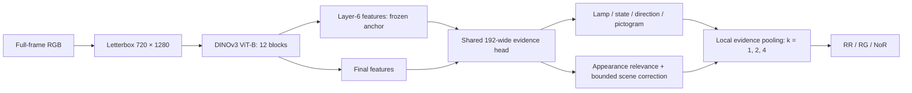

# LoRA feasibility for DINOv3 traffic-light relevance

Historical research record. Experimental runners are archived in [the source snapshot](recall_head/source_snapshot.zip); active training uses [the supported configuration](../../configs/default.yaml). Commands below describe the original study.
Analysis date: 7 October 2026. This is an architecture and saved-result analysis, not a completed LoRA experiment. The recommended starting point is the frozen **ViT-B/16 fold-0, epoch-7 EMA** model. The default ViT-S+ model and all historical reports remain separate.

**Judgment:** a small, late-layer LoRA experiment is technically appropriate and could improve balanced accuracy by improving lamp state/relevance features. The current evidence does not establish that LoRA will improve external generalization. The frozen model already exhibits a substantial training-versus-held-out-city gap, concentrated in NoR, so adapting the encoder introduces a real additional route to overfitting. Acceptance must require preserved signal recall and external metrics, rather than balanced accuracy alone.

## Current architecture and the opportunity

The full RGB frame is letterboxed to 720×1280, then encoded by a frozen 12-block DINOv3 ViT-B/16. Each image has 3,600 patch tokens plus one CLS and four register tokens. Register tokens participate inside the encoder but are excluded from the downstream head. Layer-6 patch/CLS features and final-layer features are concatenated into 1,536-dimensional inputs.

The 412,830-parameter head projects each token to width 192 and uses a shared appearance trunk. Lamp, state, relevance, direction and pictogram supervision help it learn a physically meaningful decomposition. RR evidence combines lampness, relevance and red/yellow/red-yellow state; RG uses the corresponding green state. A lamp-weighted local 5×5 operation and top-k means at 1/2/4 scales aggregate evidence. CLS and image geometry affect relevance only through a bounded ±1 correction, with 50% context dropout.

The readout is deliberately coupled: signal logits increase with their evidence, while `NoR = bias − positive_scale_RR × evidence_RR − positive_scale_RG × evidence_RG`. This discourages an unrestricted scene classifier but means a high-scoring irrelevant lamp can suppress NoR. Conversely, missed small lamps can produce false NoR. LoRA can change the final patch and attention features feeding this head, improving relevance, colour/state discrimination and false-lamp suppression. It does not change the 16-pixel patch size, restore detail lost during resizing, supply missing training examples, or resolve an ambiguous label definition.

These are plausible mechanisms inferred from the architecture. Saved image-level logits do not establish which token-level mechanism caused each error; this needs lamp/state/relevance diagnostics during the pilot.

Existing protection includes inverse-square-root image-class weighting, per-instance attribute supervision, relevance focal loss, label smoothing 0.05, dropout 0.2, EMA 0.999, photometric/degradation augmentation, modest zoom-out, and two-view consistency. All should be retained for the first comparison. The backbone capacity pilot improved frozen-feature results on every dataset; this supports starting from ViT-B but is not evidence for the effect of tuning those features.

## What the saved results show

Current ViT-B primary results use exactly aligned images and raw T=1 predictions:

| Benchmark | Balanced accuracy | Mean RR/RG recall | NoR recall | NoR support |
|:--|--:|--:|--:|--:|
| DTLD test | 71.56% | 91.44% | 31.81% | 525 |
| ATLAS manual benchmark | 82.93% | 86.37% | 76.06% | 188 |
| VZC-TLD published test only | 70.22% | 81.71% | 47.25% | 91 |

NoR is the main imbalance in class recall. Since balanced accuracy is `(recall_RR + recall_RG + recall_NoR) / 3`, a 6-point increase in NoR recall gives 2 balanced-accuracy points only when the two signal recalls stay fixed.

Fold 0 has 21,493 training images: 7,278 RR, 13,146 RG and only 1,069 NoR (4.97%). Validation contains 7,032 images from Dortmund, Kassel and Fulda, with 303 NoR. There is zero session overlap. Inverse-square-root loss weights give NoR examples about 3.51× the weight of RG examples; this is already an attempt to address rarity, not a fully class-equal objective. DTLD also lacks genuine lamp-free examples in the audited data; 2% lamp erasure supplies synthetic examples with a different appearance distribution. Relevant off/unknown-only scenes are mapped to NoR and must remain separately reported. These data issues can limit improvement even with a better encoder.

The same EMA weights evaluated on clean training-probe and held-out validation images give:

| Epoch | Probe balanced accuracy | Validation balanced accuracy | Probe NoR recall | Validation NoR recall | Probe mAP | Validation mAP |
|:--|--:|--:|--:|--:|--:|--:|
| 7, selected | 85.90% | 71.52% | 66.67% | 32.34% | 91.53% | 70.13% |
| 12 | 88.61% | 71.03% | 74.51% | 32.34% | 93.87% | 69.64% |

The probe has only 1,024 images and 51 NoR, and its cities differ from validation, so the gap combines sampling/domain differences with fit to training data. It is not a proof that every error is overfitting. However, the rising probe scores and falling held-out scores after epoch 7 are a warning against assuming that more trainable capacity alone solves the problem. The balanced-accuracy gap grows from 14.39 to 17.58 points. Validation balanced accuracy actually peaks at epoch 9 (71.62%), whereas the selected mAP checkpoint is epoch 7 (71.52% balanced accuracy). Changing checkpoint selection alone must be controlled when attributing a gain to LoRA.

The earlier axial head is another project-specific warning: its DTLD mAP improved over the old v5 fold-0 reference, while ATLAS and VZC mAP fell substantially. This does not predict LoRA's effect, but demonstrates why DTLD gains alone are insufficient.

## Validation-only decision-boundary diagnostic

I used the saved epoch-7 validation logits to inspect a **single NoR-logit offset** from −2 to +2 in 0.05 steps. No encoder/head weights were trained, and no offset was evaluated or selected using external tests. This is a fitted, in-sample validation diagnostic, not a new benchmark result.

| Validation variant | Balanced accuracy | Mean RR/RG recall | NoR recall |
|:--|--:|--:|--:|
| Original | 71.52% | 91.10% | 32.34% |
| Best unconstrained offset, +1.20 | 73.84% | 87.99% | 45.54% |
| Best offset preserving both RR and RG recall | 71.52% | 91.10% | 32.34% |

The unconstrained gain of 2.33 balanced-accuracy points costs 3.11 points of mean signal recall. No offset on this grid improves balanced accuracy while preserving both signal recalls. This suggests that shifting the decision boundary is insufficient under the user's constraint; improved separation is needed. It does not establish that LoRA is the unique or successful way to obtain that separation. Temperature scaling alone cannot change argmax classes and therefore cannot improve balanced accuracy.

Reproduce this read-only analysis with `python docs/experiments/lora_feasibility/analyze.py`. [Diagnostics](lora_feasibility/analysis.json) preserve the grid, class counts, per-epoch gaps and input SHA-256 hashes. [Completed backbone results](backbone_capacity/results/README.md) contain the primary external metrics.

## Recommended first LoRA pilot

Use **ViT-B/16**, preserve layer-6/final fusion and the complete evidence head, and adapt **query and value projections only in blocks 9–12** (zero-based indices 8–11). This leaves the layer-6 stream exactly unchanged for an identical input, while permitting the final stream to adapt. It is a conservative starting hypothesis, not a universal claim that late-layer tuning is optimal for every distribution shift.

| Setting | Proposed starting value |
|:--|:--|
| Rank / alpha | 4 / 4, standard alpha/r scaling |
| Adapter dropout | 0.05 |
| Adapter initialization | Zero effective update; reproduce the original model initially |
| Trainable backbone tensors | Q/V LoRA matrices only; original weights, biases, norms, embeddings and register-token parameters frozen |
| Targets in installed Transformers 5.6.2 | `model.layer.{8,9,10,11}.attention.{q_proj,v_proj}` |
| New adapter parameters | 49,152 |
| Head + adapter parameters | 461,982; 11.9% more than the present trainable head |
| Starting head | Existing epoch-7 EMA head |
| Proposed learning rates | Adapter 5e−6; head 1e−5, separate optimizer groups |
| Pilot budget | Fold 0 only; at most 6 additional epochs, one warm-up epoch, patience 2 on the eligible validation score |
| Effective batch | Preserve 16; adjust microbatch/accumulation after a real gradient-memory smoke |

The values are proposed experiment settings, not measured optima. Rank 4 in four Q/V pairs is 8 linear targets, each adding `4 × (768 + 768)` parameters. Updating the head jointly lets it accommodate the changed final stream. Warm-starting from its learned head avoids adapting the backbone in response to a random classifier, a choice motivated by feature-distortion research.

Run a **matched frozen-backbone head-continuation control** from the same EMA head, with the same data, augmentations, seed, epoch budget, head learning rate and checkpoint rule. Also retain the untouched epoch-7 model. This distinguishes a LoRA effect from longer head training or different checkpoint selection. Do not simultaneously introduce stronger class reweighting, replacement sampling, higher resolution or a new pooling head.

If feature drift is a concern in the pilot design, a small normalized final-patch feature penalty against the frozen ViT-B on identical inputs can provide an explicit anchor. A logit-only teacher penalty is weaker protection for dense features. This extra loss and its coefficient would need to be fixed before the run, and reported as part of the candidate; it can also prevent desired changes if too strong. Low rank and low learning rate alone are not bounds on feature drift.

## Selection and generalization requirements

Use DTLD city-disjoint validation for all epoch, rank, learning-rate and optional anchoring choices. Select by balanced accuracy **subject to neither RR nor RG recall falling below the frozen starting checkpoint**, with validation mAP also preserved; ties use higher mAP, then the earlier epoch. Apply exactly the same rule to the head-continuation control. A failed gate produces no promoted candidate. A useful target is at least +1 balanced-accuracy point beyond both the untouched baseline and the matched control, with uncertainty reported.

Measure clean-probe and validation balanced accuracy, per-class recall and precision, macro F1, mAP, worst-city metrics, NoR subtype metrics, and the probe/validation gaps at every epoch. Track adapter update norms and feature drift. A widening gap or a declining held-out score should terminate or reject the candidate; the exact stopping/gap rule should be frozen in the execution plan, rather than interpreted after seeing external results.

Freeze the selected checkpoint and protocol, then evaluate once on the same DTLD 12,453, ATLAS 528 and VZC test-only 598 images. Given the user's preservation requirement, promote only when balanced accuracy and mAP are nondecreasing on **each** dataset and neither RR nor RG recall declines on any dataset. Report NoR recall/precision and calibration even if the gate fails. If a candidate trades signal recall for balanced accuracy, record the tradeoff and retain the baseline rather than calling it an unqualified improvement.

Use paired complete-session bootstrap intervals for DTLD differences, and scene/session grouping on external data where trustworthy identifiers exist. Tiny camera or rare-class slices can be inconclusive; camera-level resampling with only three ATLAS cameras cannot supply strong generalization evidence. One changed prediction moves VZC NoR recall by 1.10 points. If the pilot passes, repeat the other city folds and, where affordable, separate seeds on an unchanged fold; changing city folds and seeds together cannot isolate seed variability.

These benchmarks have already influenced development. Passing them demonstrates observed nonregression, not a guarantee on unseen datasets. Stronger evidence requires a fresh, sequestered camera/location/scene set. No LoRA method can guarantee unchanged population generalization from DTLD-only supervision.

## Implementation requirements before training

The current source is intentionally a frozen-feature implementation. Adding adapter modules or setting `requires_grad=True` is insufficient:

- [Backbone](../../src/dinov3_global/backbone.py) freezes every tensor and wraps forward in `@torch.no_grad()`. Its `train()` override forces evaluation. Adapter gradients and adapter-only dropout need an explicit supported mode while original backbone weights remain frozen.
- [Model](../../src/dinov3_global/model.py) adds another `torch.no_grad()` around encoder calls and forces the encoder into eval. Both paths must accommodate adapters; frozen mode must retain the current behavior.
- [Training engine](../../src/dinov3_global/engine.py) optimizes and clips only head parameters. LoRA needs its own optimizer group and all trainable tensors included in clipping. The scheduler currently writes one learning rate into every group.
- EMA, validation swapping, resume, saving and inference loading currently operate only on `model.head`. They must include the adapters as one coherent head-plus-adapter state, with strict architecture/base-revision provenance. Evaluating a head EMA with live adapters would be inconsistent.
- [Configuration](../../src/dinov3_global/config.py) explicitly requires a frozen backbone. A separate adapter-mode contract should allow frozen base weights plus trained LoRA without weakening validation for historical checkpoints.
- Verify zero-update equivalence, nonzero adapter gradients, unchanged original weights after an optimizer step, active adapter dropout in training, complete EMA/resume restoration, and matching merged/unmerged inference within numerical tolerance.

The 720×1280 encoder processes 3,605 tokens. LoRA adds few optimizer parameters but requires backward activation storage through the adapted blocks, twice for two-view training; the old ~1.08 GB frozen-training peak cannot be reused as its memory estimate. A full-resolution gradient smoke is necessary before committing to a batch size on the RTX 5070 12 GB. Keep SDPA; use activation checkpointing or smaller microbatches if needed. Avoid quantization in the first trial because it introduces a second feature change.

Merged LoRA uses the same dense attention projection shapes and should have inference latency close to the measured ViT-B baseline of 62.03 ms/image. This is an expectation, not a new measurement; benchmark the merged candidate. Unmerged adapters add work. Preserve a reversible unmerged adapter checkpoint and original base identity.

## Research context

[Meta's DINOv3 model card](https://github.com/facebookresearch/dinov3/blob/main/MODEL_CARD.md) recommends exploiting frozen features first and notes that fine-tuning can increase dependence on the fine-tuning labels. [The original LoRA paper](https://arxiv.org/abs/2106.09685) establishes low-rank updates to frozen weights and the ability to merge them for inference; its language-model results do not establish traffic-light transfer gains. [Hugging Face's LoRA documentation](https://huggingface.co/docs/peft/package_reference/lora) describes zero-effective-update initialization and projection targeting. [Kumar et al., ICLR 2022](https://arxiv.org/abs/2202.10054) show that feature adaptation can improve in-domain accuracy while worsening performance under distribution shift, and motivate starting from a learned head; this is supporting motivation, not a direct experiment on DINOv3 or this head.

The analysis therefore supports one tightly constrained late-layer rank-4 pilot, with a matched control and explicit external preservation gates. It does not support claiming a gain in advance or expanding to all folds before that pilot succeeds.
